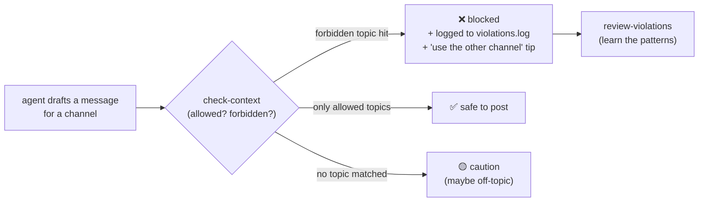
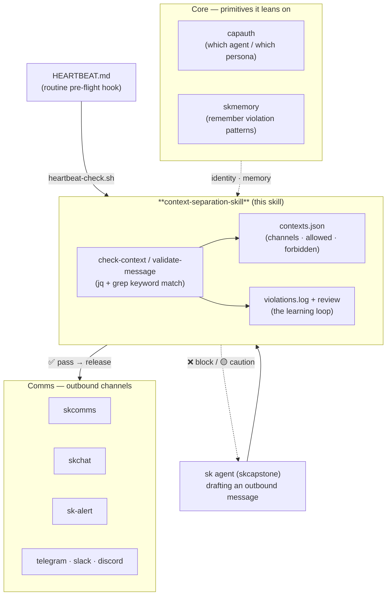

# context-separation-skill — keep your agent's mouths shut in the right rooms 🎯

> **One agent, many rooms — and never the wrong thing in the wrong one.**
> A lightweight skill that checks a message against the rules of its destination
> *before* it goes out, so business channels stay business, client A never sees
> client B, and personal requests never leak into a stakeholder report.

context-separation-skill is an **AI-agent skill** (an OpenClaw/Claude-Code skill —
`SKILL.md` + a handful of bash scripts) from the [SKWorld](https://skworld.io)
ecosystem. When one agent talks across many channels — a business Telegram group,
a personal DM, a client Slack — it's easy to *conflate* contexts: dropping "claim
my social account" into a trustee update, or a domain-renewal gripe into a revenue
report. This skill gives the agent a **fast, deterministic pre-flight check** so
that never happens.

It is **not** an AI model and needs no network: it's `bash` + [`jq`](https://jqlang.github.io/jq/)
doing keyword matching against a per-context allow/forbid list you define in one
JSON file. Dumb on purpose — predictable, auditable, zero latency.

## The 60-second version



You declare each **context** once (which channels it covers, what topics belong
there, what's banned). Before the agent posts, it runs one script; a forbidden
keyword means *don't send* and a logged note explaining why.

## Quickstart

```bash
# install into your agent's skills dir (also: curl install.sh | bash)
git clone https://github.com/smilinTux/context-separation-skill.git \
  ~/clawd/skills/context-separation
cd ~/clawd/skills/context-separation
chmod +x scripts/*.sh

# 1) define contexts (channel + the topics allowed there)
./scripts/setup-context.sh "business" "telegram:-1003785842091" "revenue,security,platform"
./scripts/setup-context.sh "personal" "telegram:1594678363"     "infrastructure,domains,social_media"

# 2) check a draft by context name — before posting
./scripts/check-context.sh --message "Platform revenue up 15%"   --context business
# ✅ Message appropriate for 'business' context
./scripts/check-context.sh --message "Claim my social account"   --context business
# ❌ CONTEXT VIOLATION: Personal request in business context

# 3) or check by channel id (auto-resolves which context owns it)
./scripts/validate-message.sh "SKGentis revenue update" "telegram:-1003785842091"

# 4) review what's been tripping you up
./scripts/review-violations.sh
```

Add the pre-flight to your agent's routine by dropping one line in `HEARTBEAT.md`:
`./skills/context-separation/scripts/heartbeat-check.sh`.

## What's in the box

| Piece | What it does |
|---|---|
| **`contexts.json`** | the config: each context = `channels[]` + `allowed_topics[]` + `forbidden_topics[]` (the single source of truth) |
| **`setup-context.sh`** | adds/updates a context in `contexts.json` (name, channel, comma-topics) via `jq` |
| **`check-context.sh`** | validate a draft **by context name** — flags forbidden keywords + built-in personal/domain heuristics; exit 1 on violation |
| **`validate-message.sh`** | validate **by channel id** — resolves which context owns the channel, checks forbidden then allowed topics, suggests the *other* channel, logs the hit |
| **`heartbeat-check.sh`** | routine pre-flight — seeds `CONTEXT-SEPARATION-RULES.md`, prints active contexts, reminds before updates |
| **`log-violation.sh`** | manually record a conflation incident (timestamped to `violations.log`) |
| **`review-violations.sh`** | summarize `violations.log` — totals, recent, most-common patterns |
| **`references/common-contexts.md`** | a playbook of appropriate/inappropriate topics + red-flag phrases per context type |
| **`SKILL.md`** | the agent-facing skill card (name, description, when-to-use, commands) |

### How a context is shaped

```json
{
  "business": {
    "channels": ["telegram:-1003785842091"],
    "allowed_topics": ["revenue", "security", "platform", "deployment"],
    "forbidden_topics": ["personal", "social_media", "domains", "git push"]
  },
  "personal": {
    "channels": ["telegram:1594678363"],
    "allowed_topics": ["infrastructure", "domains", "personal", "social_media"]
  }
}
```

Matching is case-insensitive substring (`grep -qi`) over the lowercased message.
A **forbidden** hit blocks; an **allowed** hit greenlights; no match at all is a
soft "caution — maybe off-topic" rather than a hard stop.

## Where it lives in SKStack v2

This is a **Comms-tier guardrail**: it sits in front of an agent's outbound
messaging (the kind that flows through `skcomms` / `skchat` / `sk-alert`) and
borrows the **Core** identity/memory primitives for who-am-I and learning. It's a
small, sovereign skill — runs entirely local, no SaaS, in keeping with the SKWorld
model.



The other 4-C tiers — **cloud** (skfence/skmesh/skdns) and **compute**
(skdata/skmodel/skmon) — aren't touched: this skill is deliberately small, with no
model call and no network dependency, so it can't add latency or a failure mode to
the send path.

## Why it's deliberately dumb

A keyword allow/forbid list is **predictable, auditable, and instant**. There's no
model to hallucinate a verdict, no API to be down when the agent needs to send. You
can read `contexts.json`, see exactly why a message was blocked, and add the
phrase that bit you to `forbidden_topics`. The trade-off (it won't catch a
violation phrased in words you didn't list) is the right one for a guardrail that
runs on every message: better a fast, legible check you tune over time than a slow,
opaque one.

## Documentation

| Doc | Contents |
|---|---|
| **[Architecture](docs/ARCHITECTURE.md)** | the validation flow, channel-resolution, the learning loop, content map + ecosystem placement (mermaids) |
| **[SKILL.md](SKILL.md)** | the agent-facing skill card — when to use, core commands |
| **[references/common-contexts.md](references/common-contexts.md)** | appropriate/inappropriate topics + red-flag phrases per context type |

---

Part of the **[SKWorld](https://skworld.io)** sovereign ecosystem · 🐧 smilinTux
