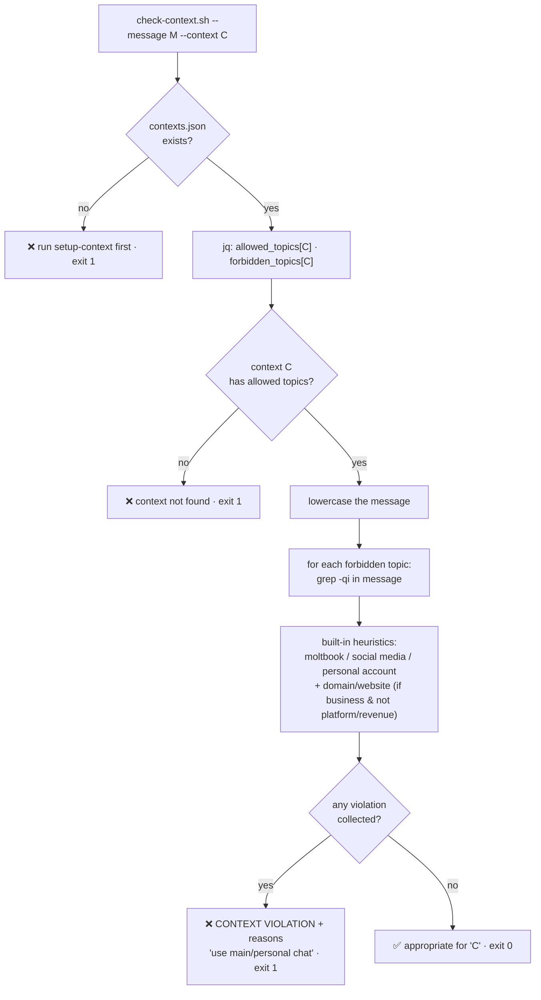
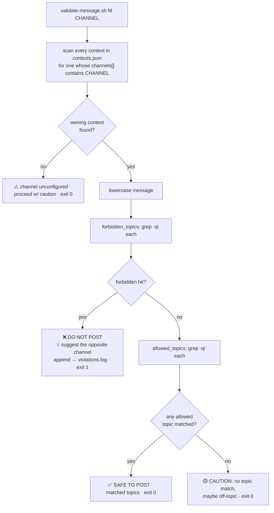
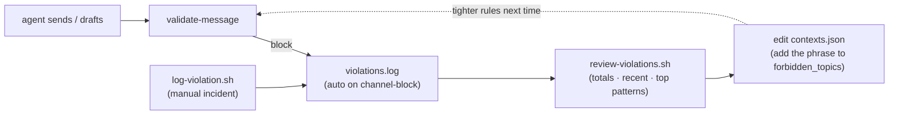
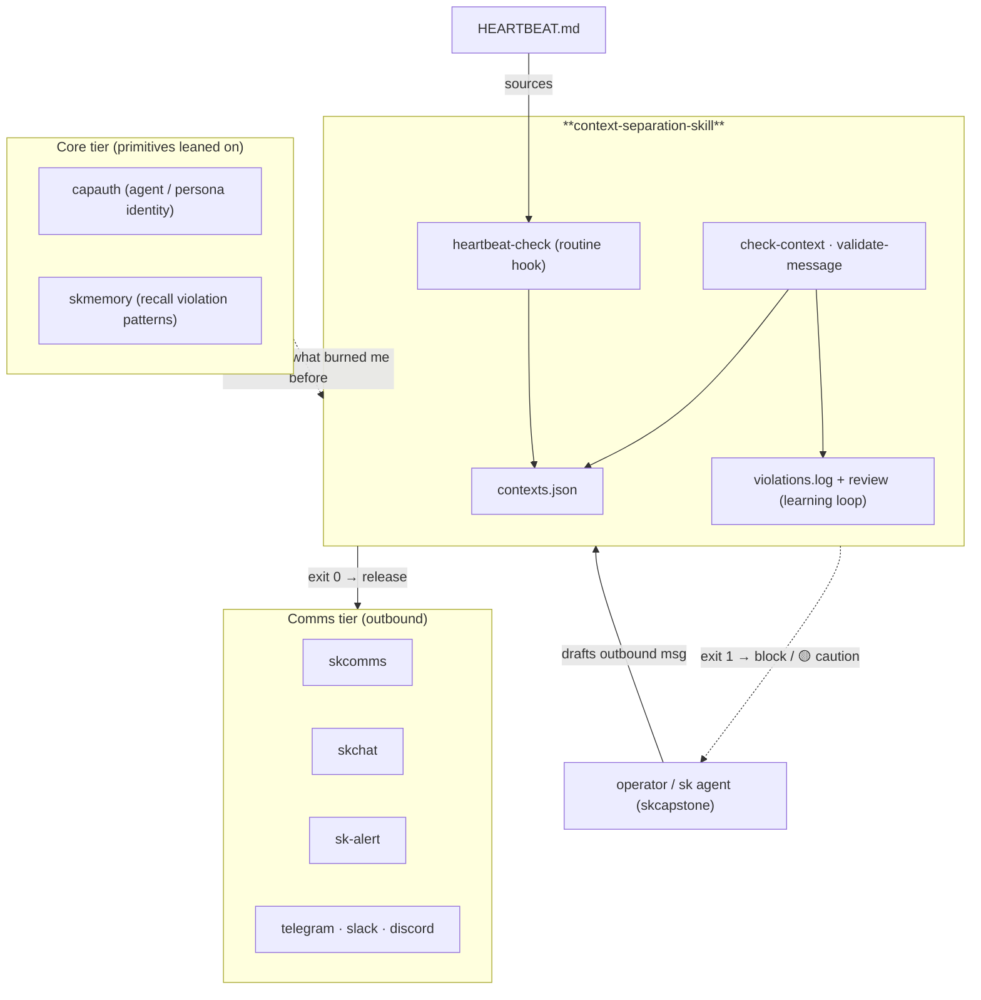

# Architecture — context-separation-skill

This skill is a **deterministic, local message guardrail**. There is no model, no
server, and no network call: every check is `bash` + [`jq`](https://jqlang.github.io/jq/)
reading one JSON config and doing case-insensitive substring matching. That makes
it instant and fully auditable — the trade-off being that it only catches phrasings
you've listed, which you tune over time via the learning loop.

## The pieces

```
context-separation-skill/
├── contexts.json              # config: per-context channels + allowed/forbidden topics
├── SKILL.md                   # agent-facing skill card (name, description, commands)
├── install.sh                 # clone-into-skills-dir installer
├── violations.log             # append-only record of blocked/logged conflations
├── references/
│   └── common-contexts.md     # playbook: appropriate/inappropriate topics + red-flag phrases
└── scripts/
    ├── setup-context.sh        # write a context into contexts.json
    ├── check-context.sh        # validate a draft BY CONTEXT NAME
    ├── validate-message.sh     # validate a draft BY CHANNEL ID (resolves context)
    ├── heartbeat-check.sh      # routine pre-flight hook
    ├── log-violation.sh        # manually record an incident
    └── review-violations.sh    # summarize violations.log
```

| Path | Role | Notes |
|---|---|---|
| `contexts.json` | **single source of truth** | object keyed by context name; each has `channels[]`, `allowed_topics[]`, optional `forbidden_topics[]`, `created` |
| `scripts/setup-context.sh` | config writer | `jq` upsert of one context (name, one channel, comma-split topics); seeds `{}` if absent |
| `scripts/check-context.sh` | validator (by name) | reads allow/forbid for the named context; flags forbidden substrings + built-in personal/domain heuristics; **exit 1** on violation |
| `scripts/validate-message.sh` | validator (by channel) | scans all contexts to find which owns the channel, then forbidden→allowed check; suggests the *opposite* channel; appends to `violations.log` |
| `scripts/heartbeat-check.sh` | routine hook | seeds `~/clawd/CONTEXT-SEPARATION-RULES.md` if missing; prints active contexts + counts; meant to be sourced from `HEARTBEAT.md` |
| `scripts/log-violation.sh` | manual logger | timestamps a free-text incident to `violations.log`; also increments `~/clawd/memory/context-rules.json` if present |
| `scripts/review-violations.sh` | reporter | total / recent / top-3 patterns from `violations.log` |
| `references/common-contexts.md` | human playbook | topic guidance + red-flag phrase lists, for tuning the topic lists |
| `SKILL.md` | skill manifest | front-matter `name` + `description` is what an agent reads to decide *when* to invoke |

## How validation works

Two entry points, same core: lowercase the message, then `grep -qi` each topic
against it. **Forbidden** matches are hard blocks; **allowed** matches greenlight;
no match is a soft caution.

### By context name — `check-context.sh`



### By channel id — `validate-message.sh`

This is the path an agent uses when it knows the *destination*, not the context
name. It resolves the owning context, then runs the same forbidden→allowed logic,
and crucially **suggests the other channel** and **logs the hit**.



**Exit codes matter**: `0` = safe (or soft-caution), `1` = block. An agent (or a
heartbeat hook) keys off the exit code to decide whether to actually send.

## The learning loop

The skill gets smarter not by training but by **you adding the phrase that bit
you**. Every block is recorded; you review patterns; you append the offending
phrase to `forbidden_topics` (or fix the topic lists). This is how the live
`contexts.json` accumulated entries like `git push`, `commit:`, `lumina.git` — each
one a real conflation that happened once and was then closed off.



## Where it lives in the SKWorld ecosystem

A **Comms-tier guardrail** that fronts an agent's outbound messaging and leans on
**Core** identity/memory primitives. It deliberately touches neither the cloud nor
compute tiers — no model call, no network — so it never adds latency or a failure
mode to the send path.



## Design notes & limits

- **Substring, not semantics.** `grep -qi` means a topic word inside a larger word
  still matches (e.g. forbidden `"git"` would hit `"legitimate"`). Choose
  distinctive multi-word phrases for forbidden entries to avoid false positives.
- **No model, by design.** The guardrail must run on *every* message; a model call
  would add latency and a failure mode. Predictability beats recall here.
- **Path coupling.** `check-context.sh`, `setup-context.sh`, `log-violation.sh`,
  and `heartbeat-check.sh` hard-code `~/clawd/skills/context-separation/...`, while
  `validate-message.sh` resolves relative to its own location. Install at the
  expected path (or symlink) so all scripts read the same `contexts.json`.
- **`jq` required.** All config reads/writes go through `jq`; it must be on `PATH`.

---

Part of the **[SKWorld](https://skworld.io)** sovereign ecosystem · 🐧 smilinTux
